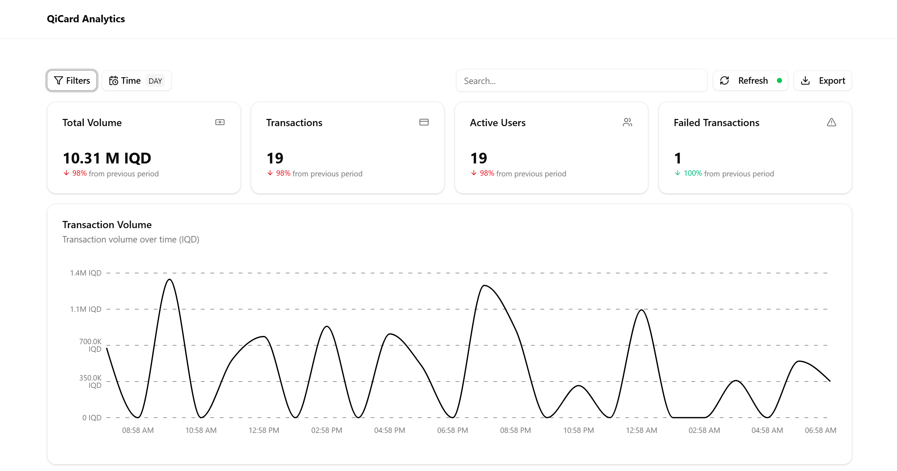
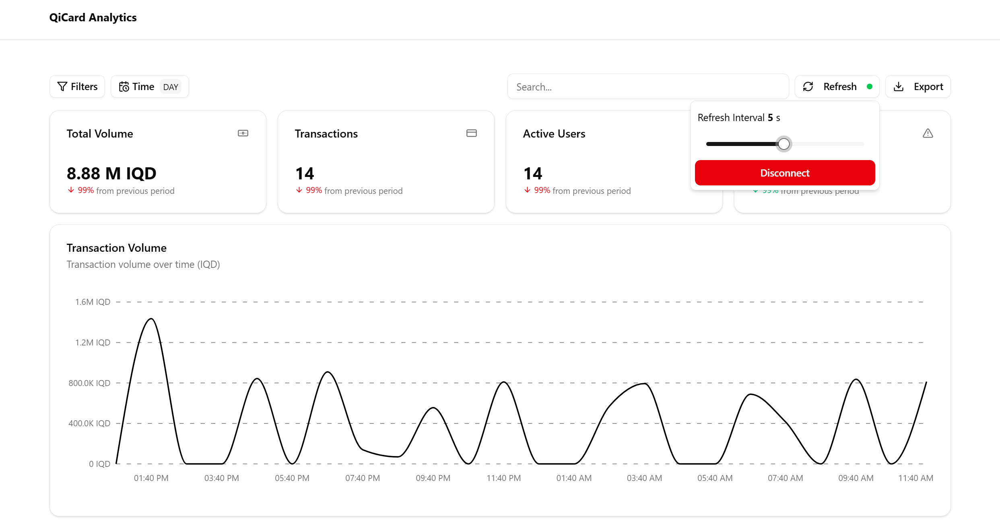
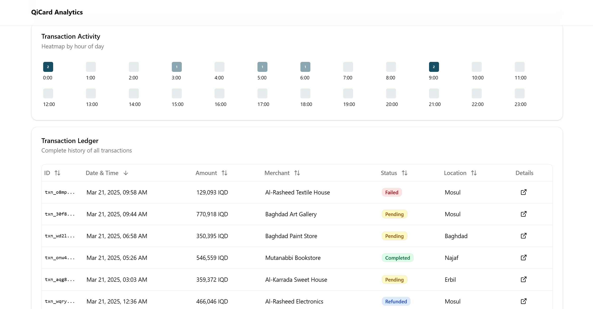
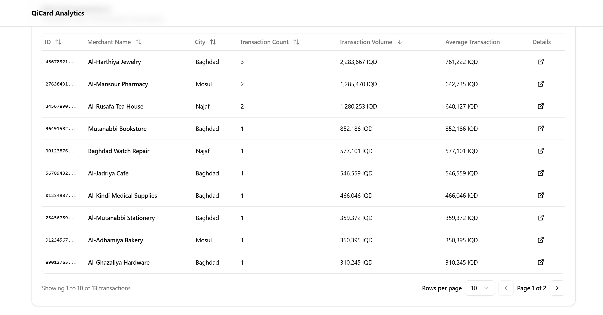
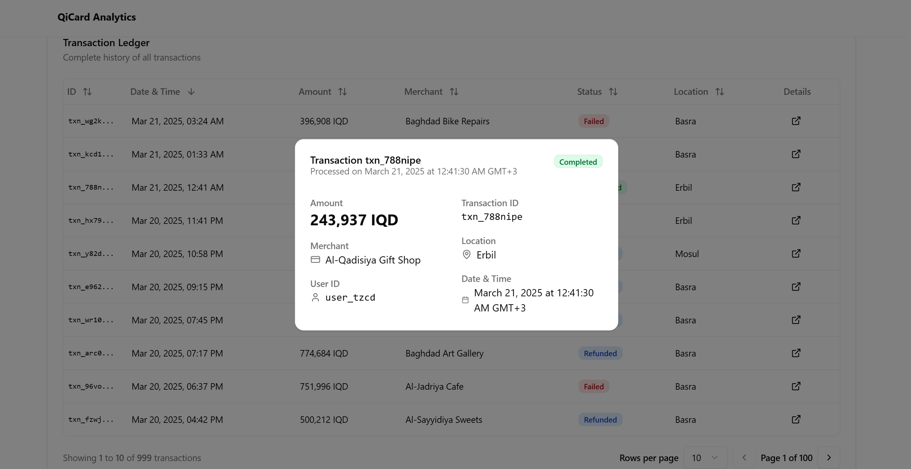
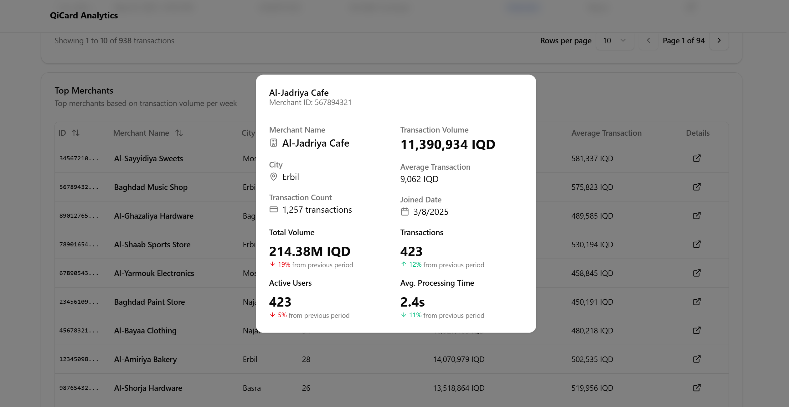

# Qi Card Analytics Dashboard

This repository contains an **Analytics Dashboard** for transaction monitoring in a fintech context. It is designed to showcase real-time transaction data, key performance metrics, and provide advanced filtering, sorting, and exporting features. This project is part of a software engineering test to demonstrate proficiency in building a scalable, modular, and user-friendly analytics interface

---

## DEMO
Please find the Dashboard application:
[Live Demo](https://analytics-dashboard-phi-blond.vercel.app/)

## Exported Data examples
The exported data examples for transaction and merchant datasets in CSV format. You can use them to test the filtering, sorting, and exporting features of the dashboard.
[Transactions data example](data/qi-transactions.csv)
[Merchants data example](data/qi-merchants.csv)

## Screenshots

Here are some screenshots showcasing the application:

1. **Main View**  
    Overview of key metrics and transaction volume.
      

2. **Tools**  
    Filtering, sorting, and exporting transaction data.
      

3. **Heatmap Transaction**  
    Visualizes transaction activity by time periods.
      

4. **Top Merchants**  
    Displays top merchants by transaction count or value.
      
    
5. **Transaction Detail Dialog**  
    Displays a dialog of the details for the transaction.
      

6. **Merchant Details Dialog**  
    Displays a dialog of the details for the merchants
      


## Design Decisions
## Design Decisions

### Why React?
React simplifies building dynamic, interactive UIs with reusable components. It is well-suited for creating scalable dashboards with features like filtering, sorting, and real-time updates.

### Why Tailwind CSS?
Tailwind CSS provides a utility-first approach to styling, enabling rapid development and consistent design. Its flexibility allowed for easy customization of the dashboard's layout and components.

### Why Zustand?
Zustand is a lightweight state management library that simplifies global state handling. It was chosen for its minimal boilerplate and ease of integration, making it ideal for managing filters, time ranges, and other shared states.

### Why Recharts?
Recharts is a powerful charting library that integrates seamlessly with React. It was selected for its ability to create visually appealing and interactive data visualizations, such as the transaction volume chart.

### Why Mock API?
A mock API was used to simulate backend operations, enabling front-end development to progress independently. This approach allowed for faster prototyping and testing of features like data fetching and exporting.

### Workflow
1. **Component-Based Architecture**: The dashboard was built using modular components (e.g., `Widget`, `TransactionTable`, `Heatmap`) to ensure reusability and maintainability.
2. **Iterative Development**: Features like filtering, sorting, and exporting were implemented incrementally, with continuous testing and refinement.
3. **Real-Time Updates**: A custom `useWebSocket` hook was developed to handle real-time data updates, ensuring the dashboard remains responsive to new transactions.
4. **UI/UX Focus**: Tailwind CSS and reusable UI components (e.g., cards, buttons) were customized to create a clean and user-friendly interface.
5. **Performance Optimization**: Techniques like lazy loading and efficient state management were employed to handle large datasets and ensure smooth interactions.

This combination of tools and methodologies resulted in a scalable, performant, and user-centric analytics dashboard.


## Future Enhancements

1. **Roadmap (Arabic Version with i18n Support)**  
    - Implement **multi-language support** using libraries like `react-i18next` or `next-i18next`.  
    - Add an **Arabic translation** for all UI elements, including labels, buttons, and dialogs.  
    - Ensure **RTL (Right-to-Left)** layout compatibility for Arabic users.  
    - Provide a **language toggle** option in the header or settings.  

2. **Improved Error Handling**  
    - Add **global error boundaries** to catch unexpected errors and display user-friendly messages.  
    - Implement **retry mechanisms** for API calls in case of network failures.  
    - Show **toast notifications** for errors like failed data fetching or exporting.  
    - Log errors to a **monitoring service** (e.g., Sentry) for better debugging and tracking.  

3. **Additional Features**  
    - **Customizable Widgets**: Enable users to customize widget layouts and save their preferences.  
    - **Access Control**: Add role-based permissions to restrict access to certain features or data.  
    - **Dark Mode**: Provide a toggle for light/dark themes to enhance usability.  


## Overview

**Objective:**

Create an advanced analytics dashboard for fintech applications to monitor transactions in real time. The dashboard includes multiple data visualization components (graphs, tables, heatmaps) and supports real-time updates, filtering, sorting, and exporting transaction data.

**Key Goals:**

- Present a clear overview of transaction volume, active users, failed transactions, etc.
- Enable robust filtering and sorting by date, amount, status, and location.
- Provide real-time data updates (via WebSockets or long-polling).
- Allow data export in common formats (e.g., CSV).
- Design a modular system that can be easily extended with new widgets and components.

---

## Features

1. **Transaction Volume Over Time**
    - Displays total transaction volume using an area chart (powered by [Recharts](https://recharts.org/)).
    - Supports time ranges (day, week, month, year).
2. **Heatmap of Transaction Activity**
    - Shows transaction count distribution by hour of the day (or by day/week/month/year) in a grid layout.
3. **Top Merchants Table**
    - Renders a paginated list of merchants sorted by transaction count or value.
    - Supports searching by merchant name and filtering by location/status.
4. **Real-Time Updates**
    - Utilizes a custom `useWebSocket` hook to listen for new transaction events.
    - Automatically refreshes charts and tables when new data arrives.
5. **Sorting & Filtering**
    - Sort transactions by amount, date, and status.
    - Filter by amount range, status (completed, pending, failed, refunded), and location (Baghdad, Erbil, etc.).
    - Time-range selection (24h, week, month, year).
6. **Export Functionality**
    - Export transactions or merchant data in CSV format (JSON or other formats can be added easily).
    - Includes dedicated buttons in the UI for exporting.
7. **Modular Design**
    - Built with reusable **Widgets** (`Widget` and `WidgetWrapper` components).
    - New components (charts, tables, etc.) can be easily added to the layout.
8. **Error Handling**
    - Basic error handling for API calls (e.g., `try/catch` around fetches).
    - Graceful fallback UI when data is unavailable.

---

## Technology Stack

- **React** (with Vite) – Main library for building the UI.
- **TypeScript** – Provides type safety throughout the codebase.
- **Tailwind CSS** – Utility-first CSS framework for styling.
- **Recharts** – Data visualization library for the volume chart.
- **Lucide Icons** – Icon set used for UI elements.
- **Zustand (Store)** – Lightweight state management for filters, time range, etc.
- **Mock API** – Simulated backend for fetching transactions and merchant data.
- **WebSockets** – For real-time data updates (simulated in `useWebSocket` hook).

---

## Project Structure

A brief overview of the key folders and files:

```
arduino
Copy
analytics-dashboard/
├─ src/
│  ├─ components/
│  │  ├─ header/            // Header component
│  │  ├─ widgets/           // Dashboard widgets (stats, volume chart, heatmap, etc.)
│  │  ├─ transactions/      // Transaction history table
│  │  ├─ merchants/         // Merchant history table
│  │  ├─ tools/             // Filtering, exporting, refreshing tools
│  │  └─ ui/                // Reusable UI components (cards, popovers, sliders, etc.) (shadcn)
│  ├─ hooks/
│  │  └─ use-websocket.ts   // Custom hook for WebSocket real-time updates
│  ├─ lib/
│  │  └─ store.ts           // Zustand store for managing global state
│  ├─ service/
│  │  ├─ api.ts             // Mock API methods
│  │  └─ export-data.ts     // Exporting data functionality
│  ├─ types/
│  │  └─ transactions.d.ts  // Type definitions for transaction data
│  ├─ App.tsx               // Main dashboard page layout & logic
│  └─ main.tsx              // Application entry point
├─ package.json
├─ README.md                // Project documentation
├─ tsconfig.json
└─ vite.config.js

```

---

## Setup & Installation

1. **Clone the repository**:
    
    ```bash
    git clone https://github.com/your-username/analytics-dashboard.git
    cd analytics-dashboard
    ```
    
2. **Install dependencies**:
    
    ```bash
    npm install
    ```
    
    or
    
    ```bash
    yarn
    ```
    
3. **Start the development server**:
    
    ```bash
    npm run dev
    ```
    
    This will start the local development server (usually at `http://localhost:5173` or `http://localhost:3000`, depending on your Vite config).
    
4. **Build for production**:
    
    ```bash
    npm run build
    ```
    
    The optimized production build will be output to the `dist/` folder.
    

---

## Usage

- **Filters**:
    
    Click the **Filters** button to adjust transaction amount range, status, and location. You can reset filters at any time.
    
- **Time Range**:
    
    Click the **Time** button to switch between `day`, `week`, `month`, and `year` views. The charts and tables will update accordingly.
    
- **Search**:
    
    Use the search bar (top-right) to search for transactions or merchants by name/ID.
    
- **Real-Time Connection**:
    
    Click **Refresh** → **Connect** to simulate a WebSocket connection. New transactions that match your filters will appear automatically.
    
- **Export**:
    
    Click the **Export** button to download transactions or merchant data in CSV format.
    

---

## Implementation Details

1. **State Management**:
    - Uses [Zustand](https://github.com/pmndrs/zustand) for storing global state such as `timeRange`, `filters`, `searchQuery`, etc.
    - Makes it straightforward to share state across components without heavy boilerplate.
2. **Data Fetching & Mock API**:
    - `mockAPI` simulates backend endpoints for:
        - `getTransactionData()` – aggregates for volume, active users, etc.
        - `getTransactionHistory()` – paginated transaction data.
        - `getMerchants()` – paginated merchant data.
    - In a real-world scenario, replace these with actual API calls or GraphQL queries.
3. **Real-Time Updates** (`useWebSocket`):
    - Listens for a `"newTransaction"` event and triggers `loadData()`, `loadTransactions()`, and `loadMerchants()` if the new transaction matches current filters.
    - Provides a `connectionStatus` (connected, disconnected, connecting) that can be toggled via the **Refresh** tool.
4. **Charts**:
    - **Volume Chart** uses `Recharts`’s `<AreaChart>` component to display transaction volume over time.
    - **Heatmap** is a custom grid-based component showing transaction counts by hour/day/week/month.
5. **Widgets**:
    - `Widget` (and `WidgetWrapper`) provide a consistent layout for each dashboard module (title, description, content area).
    - Facilitates easy addition of new widgets in the future.
6. **Export**:
    - `exportData` and `exportMerchants` functions fetch data in the chosen format (CSV here) and trigger a download in the browser.
7. **Error Handling**:
    - Each data load is wrapped in `try/catch`. In production, consider adding user-facing error messages or fallback components.

---

## Future Extensibility

- **Additional Charts/Widgets**:
    
    Easily add new visualizations (e.g., bar charts, pie charts) by creating new components under `components/widgets/` and referencing them in `App.tsx`.
    
- **Authentication/Authorization**:
    
    Integrate a real login flow to secure the dashboard, especially for sensitive fintech data.
    
- **Pagination & Infinite Scroll**:
    
    Enhance transaction/merchant lists with infinite scrolling or improved pagination controls.
    
- **API Integration**:
    
    Replace the `mockAPI` with real backend endpoints. Ensure secure connections (HTTPS) and proper error handling for production use.
    
- **Theme Customization**:
    
    Currently uses Tailwind for styling. Extend or customize the theme for brand-specific UI.
    
- **Unit & Integration Tests**:
    
    Add testing (e.g., Jest, React Testing Library) to ensure reliability and catch regressions early.
    

---

## License

This project is provided for demonstration and educational purposes. If you plan to use it in a commercial setting, please include an appropriate license and adhere to any third-party licenses for dependencies used in this project.

---

**Thank you for checking out the Qi Card Analytics Dashboard!**

Feel free to reach out if you have any questions or suggestions.